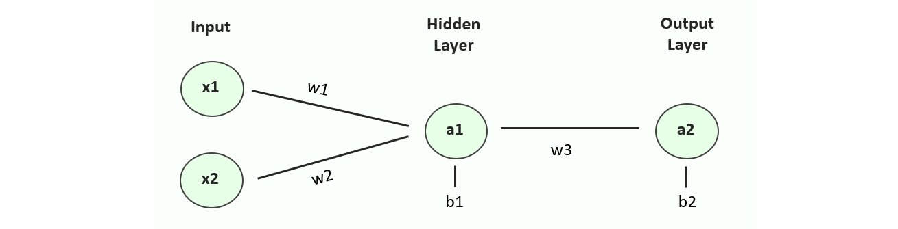

<h2 align="center"> Vanilla Neural Network in Excel </h2>

    
    
    

## Summary

I undertook this work as an educational exercise, to see if I could write a fully functional multilayer perceptron (or vanilla neural network) from scratch, using only simple functionality in excel and some calculus to work through the backpropagation algorithm. I wrote the sheet to be interactive, giving the user control over many aspects of the learning process, from input data, to learning rates & number of iterations. For more technical information please read on or contact me on linkedin.

<em>Figure 1. Animated image taken from the spreadsheet in this repository. The user is performing multiple iterations of gradient descent through a macro button, automatically updating the prediction surface and parameters vs cost x-plots.</em>

## Model Details

#### Input Data

The network takes 8 samples as input, with 2 features per sample (x1 & x2) and binary labels. This raw data can be found in the top left-hand corner of the sheet. Both features and labels may be customised by the user. The input data (features) are automatically normalised to between 0 and 1 prior to training.

#### Model Architecture

A very simple model architecture was chosen to reduce the complexity in calculus required in the backpropagation stage. The input layer has 2 neurons owing to the 2 input features and there is a single hidden layer of a single neuron before the output of another single neuron. 

<em>Figure 2. Neural network architecture used in this sheet, showing the 5 trainable parameters: 3 weights and 2 biases.</em>

#### Activation Functions

A sigmoid activation function has been used for both our hidden layer and output layer. Using a sigmoid activation is necessary for the output layer as we are working on binary classification. It is often typical to use a RELU function for hidden layer activations however, as we only have a single neuron in the hidden layer it would be counterproductive for this to become inactive.

#### Loss Function

Before any training can occur, we first need to define our objective function or loss function. It’s essential that our loss function strongly (or ideally fully) correlates with how we define success. In this example we are using binary cross-entropy, a typical choice for binary classification problems.

#### Optimiser
<!--

-->
